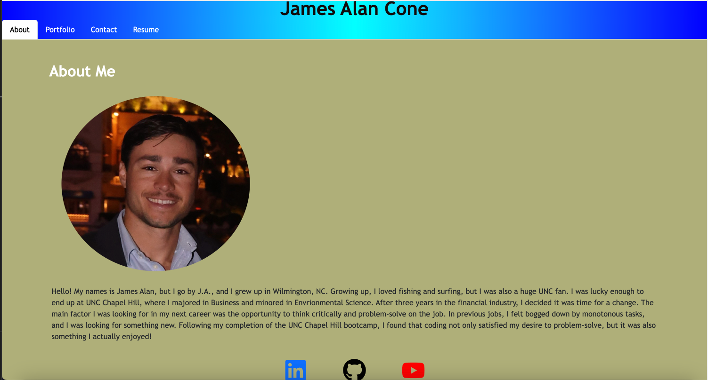
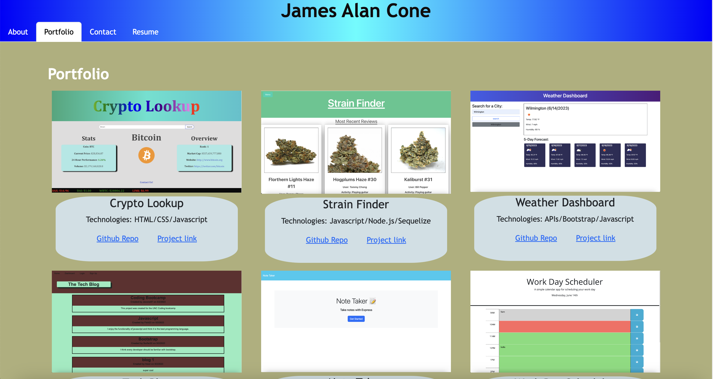
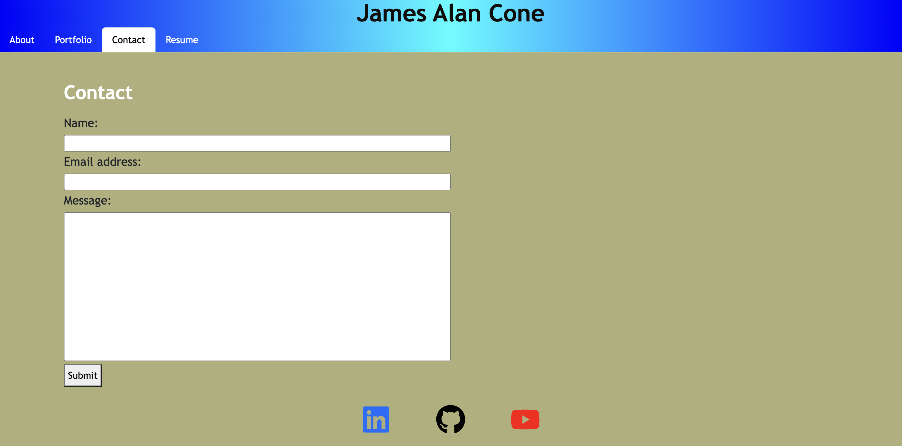
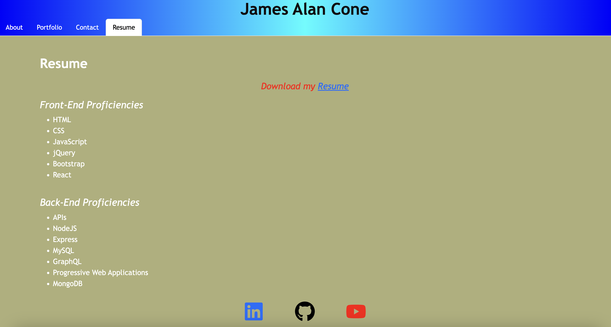

# React Portfolio

## Description
This Portfolio website was created with React to showcase my current work and give a little detail about my background. This is a single page web application that allows the user to click on different tabs to view my work, contact me, or see my resume. 

## Installation
N/A

## Usage
The webpage is designed to display my portfolio to prospective employers. When you click on the link, the default homepage is the About Me section. This shows a headshot and brief summary about me. Additionally, the bottom of the page contains icons that link to my LinkedIn, GitHub, and Youtube. These icons are located on each tab in the application.

To view a different page, you click on one of the navigation links at the top of the page. When you hover over a navigation link, it will become outlined and then highlighted in white once selected. The portfolio page displays 6 of my recent projects and includes a photo, the project name, technologies used, and links to my github repo and project.

The next section is the contact section. It allows a user to enter a name, email, and message to submit to my email. It contains validations to ensure that an actual email address has been entered and that the name and message inputs are not blank. If you try to submit without a valid email or no message, then an error message will appear. 

The final section is the resume. It contains a link to download my resume and a list of my proficiencies. 

Below is a link to the active website:

## Credits
https://github.com/gitname/react-gh-pages

## License
Please refer to the license in the repo.